# Markdown 快速入门
Markdown 是一种轻量级标记语言，创始人为 John Gruber。它允许人们「使用易读易写的纯文本格式编写文档，然后转换成有效的 XHTML（或者 HTML）文档」。——维基百科

**Markdown 的本质是让我们回归到内容本身，注重文章本身的结构，而不是样式。<span style="font-size:18px">并且它支持内嵌HTML！</span>**

---

### Markdown 文件
Markdown文件以 .md 或 .markdown 结尾。

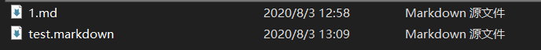

---

### Markdown 编辑器
上网搜，很多，本人程序员，所以用的VSCode。

---

### 段落
段落前后必须是空行，要在段落内换行必须在行尾加上两个空格，然后在下一行写新内容。

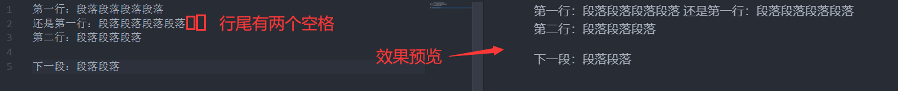

---

### 标题
\#号加空格开头的内容是标题，几个#号表示几级标题，级数越大字体越小。

比如：
```markdown
# 一级标题  
# 二级标题  
### 三级标题  
……
```

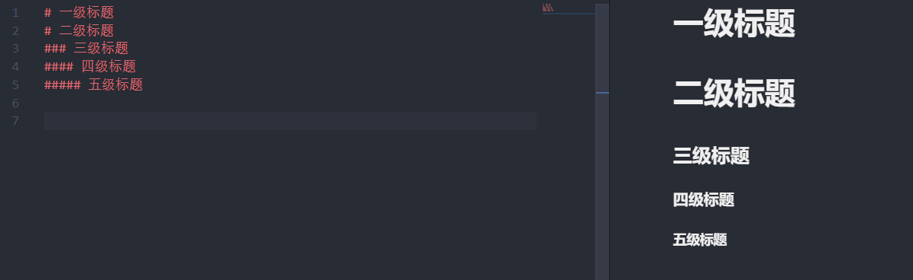

还有另外一种设置标题的方法

比如：
```markdown
一阶标题
===

二阶标题
---
```


---

### 倾斜、加粗、加粗倾斜 
倾斜：被 * 包围  
加粗：被 ** 包围  
倾斜加粗：被 *** 包围

比如：  
```markdown
*倾斜*
**加粗**
***倾斜加粗***
```


注意，因为行尾没加2个空格，所以没有换行。

---

### 删除线
用 ~~ 包裹。

比如：
```markdown
~~1111~~
```

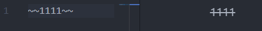

---

### 无序列表
以 * 或 - 开头再加个空格。

比如：  
```markdown
* 项目1
* 项目2
* 项目3

- 项目1
- 项目2
- 项目3
```

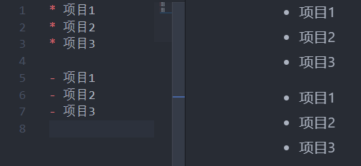

有序列表还可以进行嵌套，比如：
```
    - 111
        - 222
            - 333
```
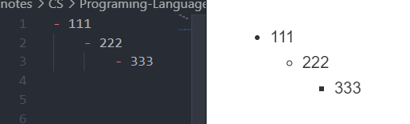

---

### 有序列表
以 数字 加 . 加空格开头。

比如：  
```markdown
1. 项目1
2. 项目2
```

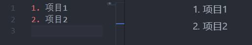

---

### 引用
以 > 加空格开头，也可以嵌套引用，用多个 > 加空格开头。

比如：
```markdown
> 欸？谁叫我
>> 我啊！
>>> 哦，原来是你！！！
```

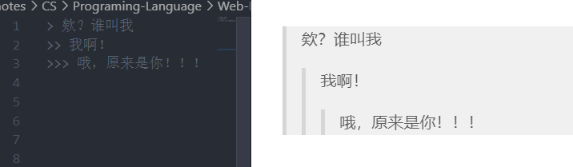

---

### 水平分隔线
单独一行 --- 或 *** 或 ___

比如：  
```markdown
---
***
___
```

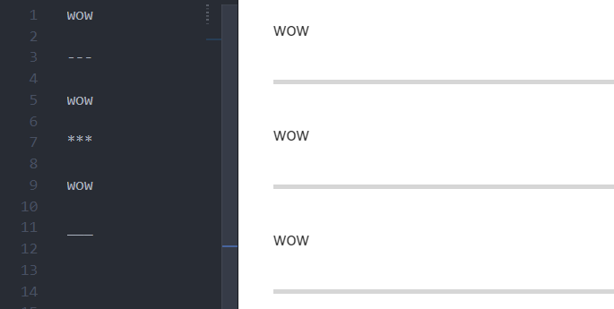

---

### 单行代码与代码块
单行：被 ` 包裹。
多行：被 ``` 包裹，或以四个空格开头。

比如：  

    ```
    printf("这就是Markdown吗，i了i了\n");
    ```

    `哇`

```VB
    MsgBox("喵喵喵！");
```


还可以注明是哪种语言，代码会被自动高亮

比如：

    ```js
    document.write("啦啦啦啦啦啦");
    ```

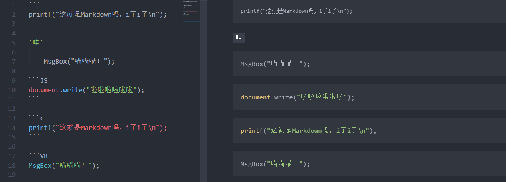

值得一提的是，如果你想把下面这段Markdown代码显示出来，可以使用缩进法(4个空格)

    ```js
    document.write("啦啦啦啦啦啦");
    ```


---

### 超链接
> 格式：\[链接文字]\(链接地址 "说明文字")

或

> \[链接文字]\[字符串常量名]

> \[字符串常量名]:链接地址 "说明文字"

第二行要单独占一段（也就是前后空行）

或

> \<链接地址\>

比如：

- [Bing](https://bing.com/ "必应搜索")

```markdown
[Bing](https://bing.com/ "必应搜索")
```

- [Bing][link1]

[link1]:https://bing.com "bing search"

```markdown
[Bing][link1]

[link1]:http://bing.com "bing search"
```

- <https://bing.com/>

```markdown
<https://bing.com/>
```

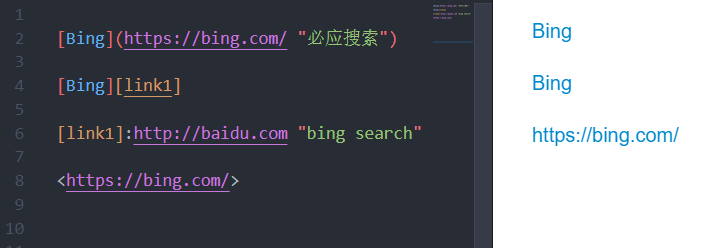

---

### 插入图片
> 格式：\![图片名]\(图片链接或路径 图片说明)

或

> \[图片名]\[字符串常量名]

> \[字符串常量名]:图片地址 "说明文字"

比如：
```markdown

```

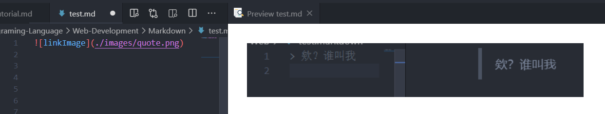

```markdown
![linkImage][link2]

[link2]:./images/linkImage.png
```
![linkImage][link2]

[link2]:./images/linkImage2.png

常量名不能重名，之前使用过link1所以现在使用link2。

---

### 脚注
> 格式：
[^常量名]

> \[^常量名]:常量值

比如：
```markdown
Google[^Google]

[^Google]:一个不存在的网站
```
Google[^Google]

试着点一下Google右上方的<sup style="color:blue">[1]</sup>，你会跳转到网页底部，在底部看见脚注信息。

[^Google]:一个不存在的网站。

---

### 表格
> |  列名  |  列名  |  
|对齐方式|对齐方式|  
|列值    |列值    |

对齐方式：  
> :--表示做对齐  
:--:表示居中  
--:表示右对齐  

比如：
```markdown
|姓名|年龄|
|:-:|:-:|
|张33333333|10000000|
|李四|123|
```
经实测，对齐方式的横线最少写1条

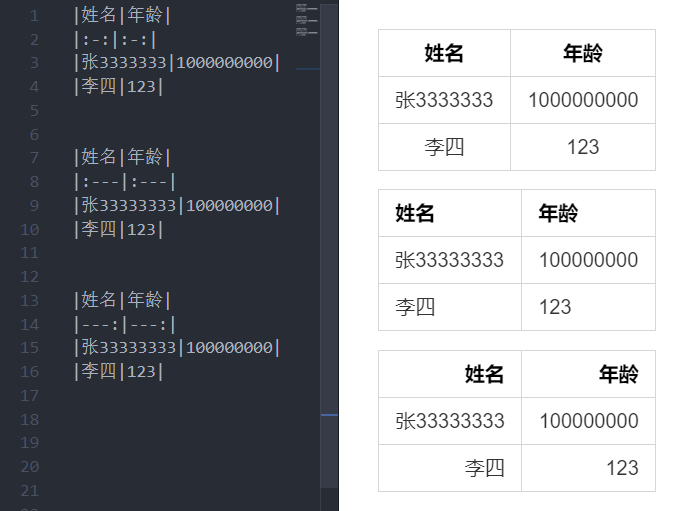


